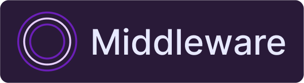
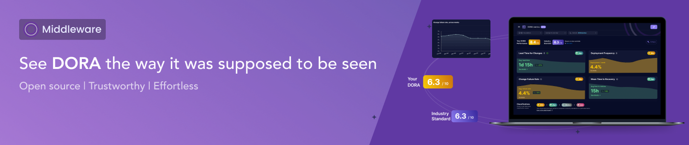
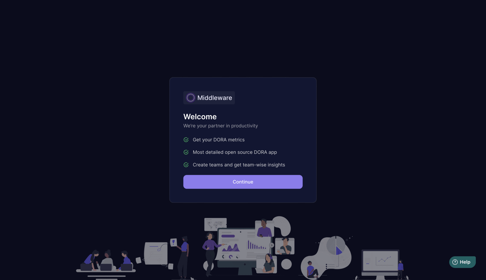

<br /><br />
<p align="center">
<a href="https://www.middlewarehq.com/">
  
</a>
</p>

<p align="center"><b>Open-source engineering management that unlocks developer potential.</b></p>

<p align="center">
<a href="https://github.com/middlewarehq/middleware/actions/workflows/build.yml">
    
</a>
<a href="https://github.com/middlewarehq/middleware/graphs/commit-activity">
    
</a>
<a href="https://github.com/middlewarehq/middleware/graphs/contributors">
    
  </a>
<br/>
<a href="https://opensource.org/licenses/Apache-2.0">
    
</a>


</p>




## Introduction
**Middleware** is an open-source tool designed to help engineering leaders measure and analyze the effectiveness of their teams using the DORA (DevOps Research and Assessment) metrics. The DORA metrics are a set of four key values that provide insights into software delivery performance and operational efficiency. They are:

- **Deployment Frequency**: The frequency of code deployments to production or an operational environment.
- **Lead Time for Changes**: The time it takes for a commit to make it into production.
- **Mean Time to Restore**: The time it takes to restore service after an incident or failure.
- **Change Failure Rate**: The percentage of deployments that result in failures or require remediation.

**Table of Contents**

- [Middleware - Open Source](#introduction)
  - [Features](#-features)
  - [Quick Start](#-quick-start)
  - [Developer Setup](#-developer-setup)
    - [Using Docker](#-using-docker)
    - [Manual Setup](#-manual-setup)
  - [Contributing guidelines](https://github.com/middlewarehq/middleware/blob/main/CONTRIBUTING.md)
  - [Security guidelines and disclosure](#security-guidelines-and-disclosure)
  - [Usage](#-usage)
  - [Examples](#examples)
  - [Contributing](#%EF%B8%8F-contributing)
  - [License](#license)

## 🚀 Features

- Integration with various CI/CD tools
- Automated collection and analysis of DORA metrics
- Visualization of key performance indicators
- Customizable reports and dashboards
- Integration with popular project management platforms

## ✨ Quick Start

Open the terminal and run the following command

```bash
docker run \
    --name middleware \
    -p 3333:3333 \
    -d \
    middlewareeng/middleware:latest
    
```

Wait for sometime for the services to be up.

The app shall be available on your host at http://localhost:3333.

In case you want to stop the container, run the following command:

```bash
docker stop middleware
```


## 👩‍💻 Developer Setup

### 🐳 Using Docker

If you dont have docker installed, please install docker [over here](https://docs.docker.com/get-docker/).
Make sure docker is running.

1. **Clone the Repository**:

   ```bash
   git clone https://github.com/middlewarehq/middleware
   ```

2. **Navigate to the Project Directory**:

   ```bash
   cd middleware
   ```

3. **Run `dev.sh` script in the project root 🪄**\
    `./dev.sh` creates a `.env` file with required development environments and run container with `docker compose watch`.\
    The usage is as follows:
   ```bash
   # runs without the ssh tunnel
   ./dev.sh
   ```
   You may update the `env.example` and set `ENVIRONMENT=prod` to run it in production setup.\
   Further if any changes are required to be made to ports, you may update the `docker-compose.yml` file, accordingly.
4. **Access the Application**:
   Once the project is running, access the application through your web browser at http://localhost:3333.
   Further, other services can be accessed at:
    - The analytics server is available at http://localhost:9696.
    - The sync server can be accessed at http://localhost:9697.
    - The postgres database can be accessed at host: `localhost`, port: `5434`, username: `postgres`, password: `postgres`, db name: `mhq-oss`.
    - The redis server can be accessed at host: `localhost`, port: `6385`.

5. **View the logs**: The logs of services running inside the container can be viewed using the following
   commands: 
     
   **frontend logs**
   ```bash
    docker exec -it middleware-dev tail --lines 500 -f /var/log/web-server/web-server.log
   ```
   **backend logs**
   ```bash
    docker exec -it middleware-dev tail --lines 500 -f /var/log/apiserver/apiserver.log
   ```
   **redis logs**
   ```bash
    docker exec -it middleware-dev tail --lines 500 -f /var/log/redis/redis.log
   ```
   **postgres logs**
   ```bash
    docker exec -it middleware-dev tail --lines 500 -f /var/log/postgres/postgres.log
   ```


### 💻 Manual Setup

To set up middleware locally, follow these steps:

1. **Clone the Repository**:

   ```bash
   git clone https://github.com/middlewarehq/middleware.git
   ```

2. **Navigate to the Project Directory**:

   ```bash
   cd middleware
   ```

3. **Run Redis and Postgres Containers**:

    If you dont have docker installed, please install docker [over here](https://docs.docker.com/get-docker/)
  
    Run the following commands to run Postgres and Redis using docker.

     ```bash
        cd database-docker && docker-compose up -d
     ```
  
    If you dont prefefer Docker, you can also choose to install [Postgres](https://www.postgresql.org/download/) and [Redis](https://redis.io/docs/latest/operate/oss_and_stack/install/install-redis/) manually.

4. Backend Server Setup

  Install python version `3.11.6`
  
  - For this you can install python from [over here](https://www.python.org/downloads/) if you don't have it on your machine.
  - Install pyenev

 ```bash
 pip install pyenv
 pyenv local 3.11.6
 ```


5. Web Server Setup
   

   - For backend:
     ```bash
     pip install -r requirements.txt -r dev-requirements.txt
     ```
   - For frontend:
     ```bash
     yarn install
     ```

6. **Build the Project**:

   - For frontend:
     ```bash
     yarn build
     ```

7. **Set up Environment Variables**:
   - Create a `.env.local` file in the `/backend` directory and add the following environment variables, replacing the values with your own:
     ```
     DB_HOST=localhost
     DB_NAME=mhq-oss
     DB_PASS=postgres
     DB_PORT=5434
     DB_USER=postgres
     REDIS_HOST=localhost
     REDIS_PORT=6385
     ANALYTICS_SERVER_PORT=9696
     SYNC_SERVER_PORT=9697
     ```
   - Update the database, redis, `ANALYTICS_SERVER_URL`, and `SYNC_SERVER_URL` values as per your setup.
8. **Run the Project**:
   - For Database:
     ```bash
     cd database-docker && docker-compose up -d
     ```
   - For backend analytics server:
     ```bash
     python app.py
     ```
   - For backend sync server:
     ```bash
     python sync_app.py
     ```
   - For frontend:
     ```bash
     yarn http
     ```

9. **Access the Application**:
   Once the project is running, access the application through your web browser at http://localhost:3333. \
   Additionally:
   - The analytics server is available at http://localhost:9696.
   - The sync server can be accessed at http://localhost:9697.


## 📈 Usage



- Setup the project by following the [steps mentioned above](#quick-start).
- Generate and Add your PAT token from code provider.
- Create a team and select repositories for the team.
- See Dora Metrics for your team.
- Update settings related to incident filters, excluded pull requests, prod branches etc to get more accurate data.


## ❤️ Contributing


To get started contributing to middleware check out our [CONTRIBUTING.md](https://github.com/middlewarehq/middleware/blob/main/CONTRIBUTING.md).

We appreciate your contributions and look forward to working together to make Middleware even better!

## Security guidelines and disclosure

To get started contributing to middleware check out our [SECURITY.md](https://github.com/middlewarehq/middleware/blob/main/SECURITY.md).

We look forward to your part in keeping Middleware secure!


## Examples 

- Sample reports and dashboards showcasing DORA metrics
- Real-world use cases and success stories
- Screenshots of the analyzer in action

## ⛓️ Security guidelines and disclosure

To get started contributing to middleware check out our [SECURITY.md](https://github.com/middlewarehq/middleware/blob/main/SECURITY.md).

We look forward to your part in keeping Middleware secure!


## License

 
 This project is licensed under the [Apache 2.0](https://github.com/middlewarehq/middleware/blob/main/LICENSE) License - see the LICENSE.md file for details.


