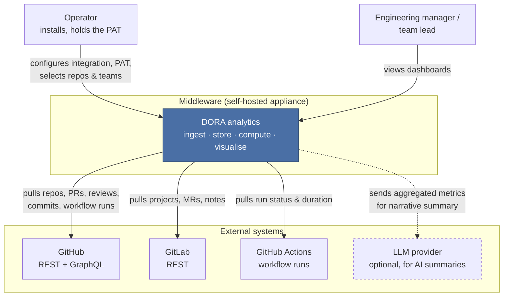
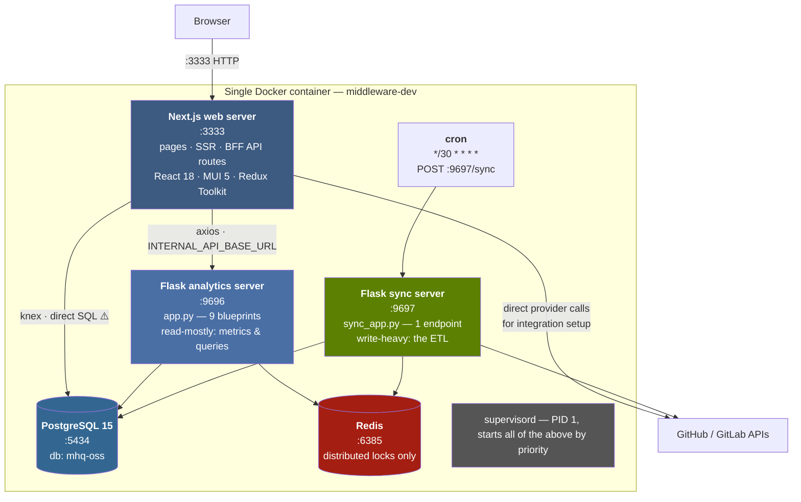
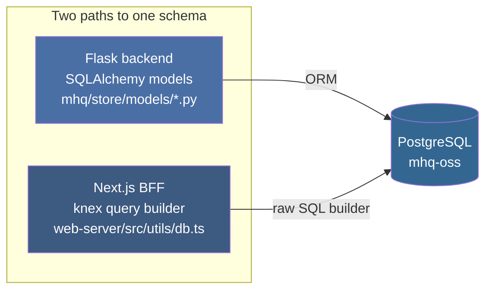
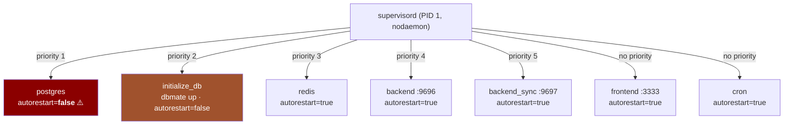
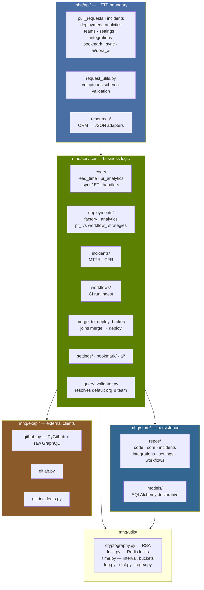
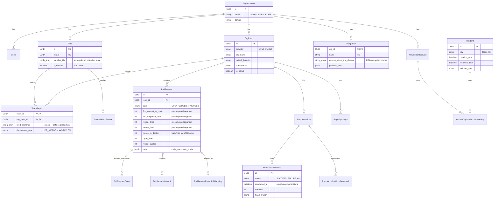
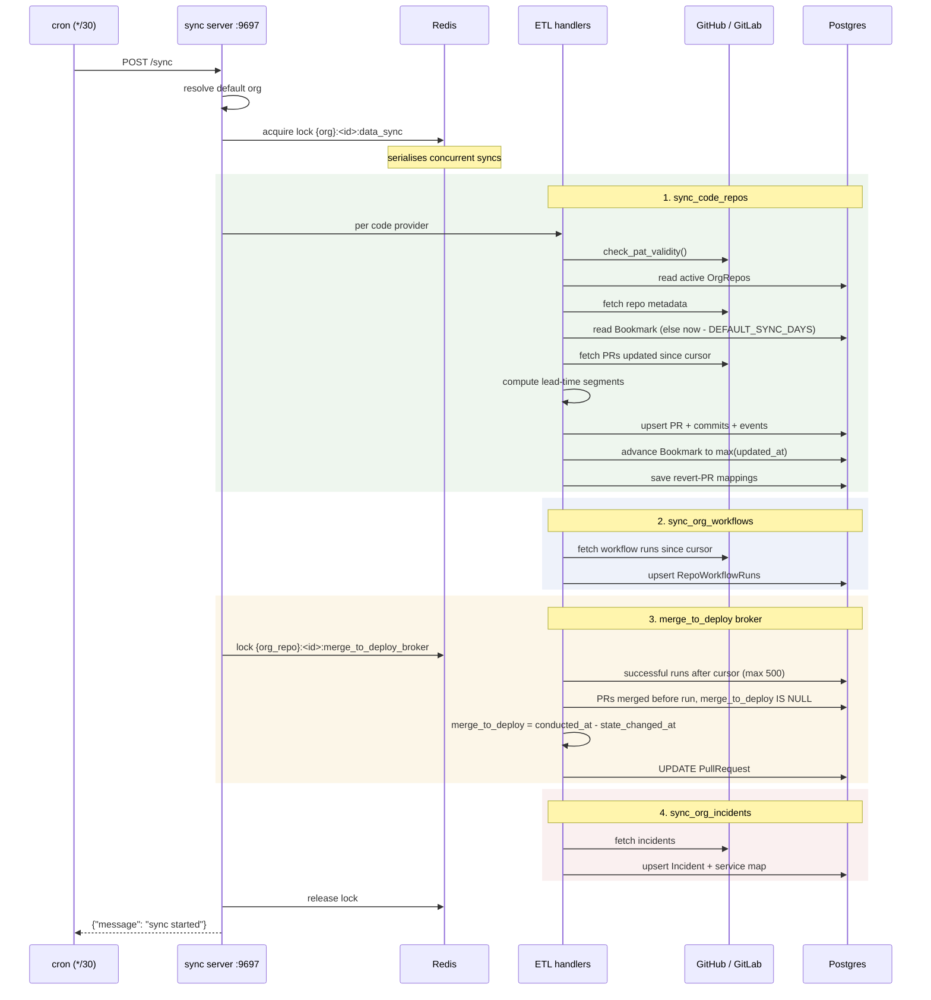
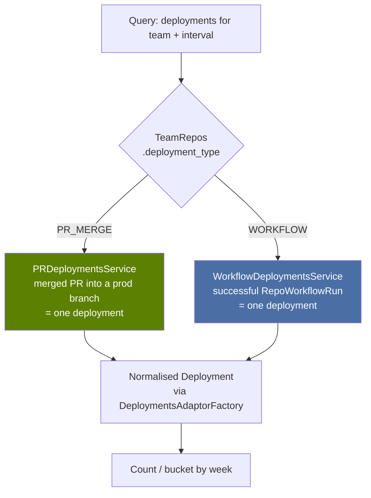
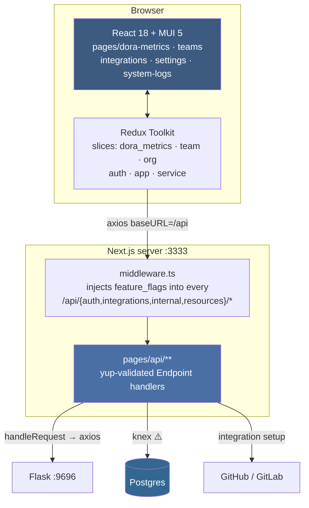

# Software Architecture Document — Middleware (Clustox fork)

| | |
|---|---|
| **System** | Middleware — open-source DORA metrics platform |
| **Upstream** | [middlewarehq/middleware](https://github.com/middlewarehq/middleware) (Apache-2.0) |
| **This fork** | [Clustox/middleware](https://github.com/Clustox/middleware) |
| **Baseline commit** | `844eb42` (`main`) |
| **Status** | Living document — update in the same PR as any architectural change |
| **Audience** | Engineers onboarding to the fork; reviewers of proposed changes |

> **Scope.** This describes the system **as it exists in the code at the baseline commit**, not as it is
> aspirationally described in the upstream README. Where the implementation diverges from the marketing
> description, the implementation is documented and the gap is flagged in
> [§10 Constraints, risks and gaps](#10-constraints-risks-and-gaps).
>
> Every claim here is traceable to a file path. If you change the code and the claim stops being true,
> the doc is now a bug — fix it in the same PR.

---

## Table of contents

1. [Purpose and context](#1-purpose-and-context)
2. [System context (C4 L1)](#2-system-context-c4-l1)
3. [Container view (C4 L2)](#3-container-view-c4-l2)
4. [Runtime and process model](#4-runtime-and-process-model)
5. [Backend component view (C4 L3)](#5-backend-component-view-c4-l3)
6. [Data model](#6-data-model)
7. [The sync pipeline — the heart of the system](#7-the-sync-pipeline--the-heart-of-the-system)
8. [How the four DORA metrics are derived](#8-how-the-four-dora-metrics-are-derived)
9. [Frontend architecture](#9-frontend-architecture)
10. [Cross-cutting concerns](#10-cross-cutting-concerns)
11. [Constraints, risks and gaps](#11-constraints-risks-and-gaps)
12. [Extension points](#12-extension-points)
13. [Glossary](#13-glossary)

---

## 1. Purpose and context

Middleware ingests engineering activity from Git providers and CI systems, stores it in a normalised
relational model, and computes the four [DORA metrics](https://dora.dev) per **team** over a
configurable time interval:

| Metric | Meaning |
|---|---|
| Deployment Frequency | How often code reaches production |
| Lead Time for Changes | First commit → deployed |
| Mean Time to Restore (MTTR) | Incident created → resolved |
| Change Failure Rate (CFR) | % of deployments that caused an incident |

**Design intent (inferred from the code, not stated upstream):** this is a *single-tenant, self-hosted*
appliance. One Postgres, one implicit organisation, no user-facing tenancy. Understanding that intent
explains most of the choices that otherwise look surprising — no auth on the analytics API, one container
running six processes, a hardcoded `default` org.

The bootstrap of that single org is explicit in
[`initialise_db.py`](../backend/analytics_server/mhq/store/initialise_db.py): on first boot the app
creates exactly one `Organization` named `default`, and every request resolves back to it via
`get_query_validator().get_default_org()`.

---

## 2. System context (C4 L1)



**Integration direction is exclusively outbound-pull.** There are no inbound webhooks anywhere in the
codebase. Everything arrives because a cron-triggered sync went and fetched it. Two consequences worth
internalising:

- Data is **stale by up to 30 minutes** by design (the cron interval).
- The system needs **no ingress from the internet** — which is the main reason its lack of API auth has
  not been catastrophic upstream.

---

## 3. Container view (C4 L2)



### 3.1 Container responsibilities

| Container | Tech | Entry point | Responsibility |
|---|---|---|---|
| Web server | Next.js (pages router), TS, MUI 5, Redux Toolkit | [`web-server/`](../web-server/) | UI, SSR, and a BFF layer under `pages/api/**` |
| Analytics server | Flask 3.0, SQLAlchemy 2.0, gunicorn | [`app.py`](../backend/analytics_server/app.py) | Serves computed metrics. Read-mostly. |
| Sync server | Flask 3.0, same ORM | [`sync_app.py`](../backend/analytics_server/sync_app.py) | Runs the ETL. Write-heavy. Deliberately a separate process. |
| Database | PostgreSQL 15 | [`database-docker/db/`](../database-docker/db/) | Single source of truth. Schema via `dbmate`. |
| Redis | Redis (no persistence configured) | — | **Distributed locks only.** Not a cache. |
| Process manager | supervisord | [`supervisord.conf`](../setup_utils/supervisord.conf) | PID 1; ordered startup, restart policy |
| CLI | Node 22, Ink (React for terminals) | [`cli/`](../cli/) | Wraps `docker compose` for a friendly local install |

### 3.2 ⚠️ The most important architectural fact in this document

**There are two independent write paths to the same database, and they do not know about each other.**



The Next.js API routes do **not** proxy everything to Flask. **23 files** under `web-server/` import
`@/utils/db` and talk to Postgres directly through knex with its own connection pool
([`web-server/src/utils/db.ts`](../web-server/src/utils/db.ts)). Table and column names are
re-declared by hand in TypeScript in `web-server/src/constants/db.ts`.

Reproduce the list yourself:

```bash
grep -rl "from '@/utils/db'" web-server/pages/api web-server/src
```

Examples of direct-SQL writes, not proxied through the API:
[`team_repos.ts`](../web-server/pages/api/resources/team_repos.ts) deactivates rows in `TeamRepos` with
a knex `UPDATE`; [`onboarding.ts`](../web-server/pages/api/resources/orgs/%5Borg_id%5D/onboarding.ts) and
[`integration.ts`](../web-server/pages/api/resources/orgs/%5Borg_id%5D/integration.ts) do likewise.

**Why this matters for every future change we make:**

1. **A schema change is a three-place change.** The `dbmate` migration, the SQLAlchemy model, *and* the
   TypeScript `Columns`/`Table` declarations. Miss the third and you get a runtime failure in the BFF
   that no Python test will catch.
2. **Business logic can be bypassed.** Validation living in a Flask service does not protect a write
   that arrives via knex.
3. **Two connection pools** contend for the same Postgres: SQLAlchemy `pool_size=10, max_overflow=5`
   per Flask process ([`store/__init__.py`](../backend/analytics_server/mhq/store/__init__.py)) and
   knex `max=7` in non-dev ([`db.ts`](../web-server/src/utils/db.ts)).

This is not a defect to fix casually — it is load-bearing, and unpicking it is a project of its own.
It is documented here so nobody discovers it the hard way. See
[§12 Extension points](#12-extension-points) for the practical checklist.

---

## 4. Runtime and process model

Everything runs in **one container** under supervisord. Postgres, Redis, two Python servers, Next.js,
and cron are siblings in a single failure domain.



Read from [`setup_utils/supervisord.conf`](../setup_utils/supervisord.conf). Notes that matter
operationally:

- **`postgres` has `autorestart=false`.** If Postgres dies, supervisord will *not* bring it back, and
  the container keeps running with every other process failing its queries. The container looks alive
  and the app is dead. This is the first thing to check when someone reports "it's up but broken".
- **Each process is individually switchable** via env flags (`POSTGRES_DB_ENABLED`, `REDIS_ENABLED`,
  `BACKEND_ENABLED`, `FRONTEND_ENABLED`, `CRON_ENABLED`). This is the seam to exploit when splitting
  the container for production — set the flag false and point the env var at an external service.
- **Every log is capped at 512 KB with `logfile_backups=0`** — rotation discards the old file. There is
  no log history beyond half a megabyte per process. Anything resembling production needs log shipping.
- Logs live at `/var/log/{postgres,init_db,redis,apiserver,sync_server,web-server,cron}/`. The UI
  surfaces them at `/system-logs` ([`pages/system-logs.tsx`](../web-server/pages/system-logs.tsx)).

### 4.1 Ports

| Port | Process | Bound to |
|---|---|---|
| 3333 | Next.js | `127.0.0.1` |
| 9696 | Flask analytics | `127.0.0.1` |
| 9697 | Flask sync | `127.0.0.1` |
| 5434 | Postgres | `127.0.0.1` |
| 6385 | Redis | `127.0.0.1` |

All five are bound to loopback on the host by
[`docker-compose.yml`](../docker-compose.yml) (`"127.0.0.1:${PORT}:${PORT}"`). **This loopback binding
is the only thing standing between the unauthenticated analytics API and the network.** See
[§11.1](#111-no-authentication-on-the-backend-apis).

### 4.2 Schema migrations

`dbmate`, not Alembic — despite the backend being SQLAlchemy.
[`init_db.sh`](../setup_utils/init_db.sh) waits for Postgres, creates the database if absent, then runs
`dbmate -u "$DB_URL" up` against
[`database-docker/db/migrations/`](../database-docker/db/migrations/).

There are only **4** migration files, the earliest named `20240404142732_init.sql`. The full schema
lives in [`database-docker/db/schema.sql`](../database-docker/db/schema.sql). Two implications:

- SQLAlchemy models are **hand-kept in sync** with SQL migrations. Nothing auto-generates or verifies
  the correspondence — no `alembic revision --autogenerate`, no drift check in CI. A model/schema
  mismatch is caught only at runtime.
- Adding a migration means writing SQL by hand and updating the model by hand. Adding a **drift check**
  to CI is one of the highest-value, lowest-risk hardening changes available to us.

---

## 5. Backend component view (C4 L3)

The backend is cleanly layered, and this consistency is its best quality — it makes the codebase far
more tractable than its size suggests.



**The layering rule, stated plainly:** `api → service → store/repos → store/models`, with `exapi`
reachable only from `service`. No layer reaches backwards. Every future change should preserve this —
it is the property that makes the code navigable.

### 5.1 Dependency injection convention

Services take their collaborators as constructor arguments and are assembled by module-level
`get_*_service()` factory functions:

```python
# mhq/service/code/sync/etl_handler.py
code_etl_handler = CodeETLHandler(
    CodeRepoService(),
    etl_factory(provider),                        # provider-specific strategy
    get_merge_to_deploy_broker_utils_service(),
    get_bookmark_service(),
    get_settings_service(),
)
```

Follow this pattern in new code. It is why the test suite can substitute fakes without a DI framework,
and it is what makes the provider-strategy pattern in §12.1 work.

### 5.2 Blueprint registration

Nine blueprints on the analytics server, two on the sync server
([`app.py`](../backend/analytics_server/app.py), [`sync_app.py`](../backend/analytics_server/sync_app.py)).
`hello` is registered on both as a health endpoint. Adding an API surface means creating a blueprint
module and registering it in the relevant entry point — there is no auto-discovery.

### 5.3 Selected endpoints

Generate the current list with:

```bash
grep -rn -A1 '@app.route' backend/analytics_server/mhq/api/
```

| Method | Path | Purpose |
|---|---|---|
| GET | `/teams/<team_id>/lead_time` | Lead time, aggregate |
| GET | `/teams/<team_id>/lead_time/trends` | Lead time, weekly buckets |
| GET | `/teams/<team_id>/lead_time/prs` | Contributing PRs (drill-down) |
| GET | `/teams/<team_id>/deployment_frequency` | Deployment frequency |
| GET | `/teams/<team_id>/deployment_analytics` | Deployments + related PRs |
| GET | `/teams/<team_id>/mean_time_to_recovery` | MTTR |
| GET | `/teams/<team_id>/change_failure_rate` | CFR |
| GET | `/teams/<team_id>/deployments_with_related_incidents` | Deploy↔incident join |
| GET/PUT | `/teams/<team_id>/settings` | Team settings |
| GET/PUT | `/orgs/<org_id>/settings` | Org settings |
| GET | `/orgs/<org_id>/integrations/{github,gitlab}/...` | Repo/org discovery |
| PUT | `/orgs/<org_id>/bookmark/reset` | **Force full re-sync** |
| POST | `/ai/dora_score`, `/ai/*_trends` | LLM narrative summaries |
| POST | `/sync` | Trigger ETL *(sync server, :9697)* |

Note the shape: almost every analytics route is `GET /teams/<team_id>/<metric>` with an interval and
filter in the query string, and most have a paired `/trends` variant. New metrics should follow it.

---

## 6. Data model

Tables use `PascalCase` — unusual for Postgres, and it means **every raw SQL reference needs double
quotes** (`SELECT * FROM "PullRequest"`). Expect to be bitten by this once.



### 6.1 Three modelling decisions worth understanding

**1. Lead-time segments are precomputed and stored on the row.**
`PullRequest.first_commit_to_open`, `first_response_time`, `rework_time`, `merge_time`, and
`merge_to_deploy` are integer **seconds**, written during ETL rather than derived at query time
([`models/code/pull_requests.py`](../backend/analytics_server/mhq/store/models/code/pull_requests.py)).

This makes reads fast and writes authoritative — and it means **changing a metric definition does not
change historical data**. Old rows keep their old numbers. Any change to how a segment is computed
requires a backfill or a bookmark reset (`PUT /orgs/<org_id>/bookmark/reset`) to be visible in
history. This is the single most common way to get a confusing result after a "simple" metric change.

**2. `TeamRepos.prod_branches` is where "production" is defined.**
A `string[]` of branch regexes, per team, per repo. There is no environment concept, no deploy target
model. "Production" means "matched one of these branch patterns". Everything downstream —
deployment frequency, lead time, CFR — inherits this definition.

**3. `TeamRepos.deployment_type` selects the deployment strategy per repo.**
`PR_MERGE` (a merge to a prod branch *is* the deployment) or `WORKFLOW` (a successful CI run is the
deployment). This enum is the switch that picks a strategy class at query time — see §8.1.

### 6.2 Incremental sync cursors ("bookmarks")

Four separate cursor tables, so a failure in one stream does not rewind the others:

| Table | Cursor for |
|---|---|
| `Bookmark` | PR sync, keyed `(repo_id, type)` |
| `BookmarkMergeToDeployBroker` | Merge-to-deploy backfill position |
| `RepoWorkflowRunsBookmark` | CI workflow run sync |
| `IncidentsBookmark` | Incident sync |

Cursors are stored as **ISO-8601 strings**, not timestamps. On first sync there is no cursor, so the
window falls back to the `DEFAULT_SYNC_DAYS` setting (31 in [`env.example`](../env.example)) —
resolved via `SettingType.DEFAULT_SYNC_DAYS_SETTING`, so the DB setting wins over the env default.

---

## 7. The sync pipeline — the heart of the system

If you read only one section, read this one. Almost every bug and every feature request lands here.

### 7.1 Orchestration

[`mhq/service/sync_data.py`](../backend/analytics_server/mhq/service/sync_data.py) is the whole
orchestrator — four functions run in a fixed order:

```python
sync_sequence = [
    sync_code_repos,               # 1. repos, PRs, reviews, commits
    sync_org_workflows,            # 2. CI workflow runs
    process_merge_to_deploy_cache, # 3. join merges to deploys
    sync_org_incidents,            # 4. incidents
]
```

**The order is a real dependency, not a preference.** Step 3 needs both PRs (step 1) and workflow runs
(step 2) already in the database. Step 4's PR-derived incidents need step 1. Reordering silently
produces incomplete metrics rather than an error.

### 7.2 Sequence of a sync run



### 7.3 The merge-to-deploy broker, explained

This component confuses everyone at first, so: **a PR does not know when it was deployed at the moment
it is merged.** The deployment happens later. So `merge_to_deploy` is written as `NULL` at PR-sync time
and **backfilled on a later sync run**, once a successful workflow run exists that contains the merge
commit.

From [`mtd_handler.py`](../backend/analytics_server/mhq/service/merge_to_deploy_broker/mtd_handler.py):

```python
pr.merge_to_deploy = int((conducted_at - pr.state_changed_at).total_seconds())
```

Two operational consequences:

- **Recently merged PRs legitimately have incomplete lead time.** Their `merge_to_deploy` is `NULL`
  until a deploy catches them. A dashboard showing "lead time dropped this week" often just means the
  last few PRs have not been backfilled yet.
- **`DEPLOYMENTS_TO_PROCESS = 500`** caps how many runs are processed per repo per pass. A repo with a
  large backlog needs several sync cycles to catch up. There is no warning when the cap is hit.

### 7.4 Error handling philosophy: isolate and continue

The same `try/except/LOG.error/continue` pattern nests at four levels — org sync, provider, repo, and
PR batch. A failure in one repo does not abort the run; the rest still sync.

**The cost:** `POST /sync` returns `200 {"message": "sync started"}` even if every single repo failed.
Failures are visible **only in the logs**, which are capped at 512 KB with no rotation history and no
alerting. "Sync succeeded but the numbers look wrong" is the expected failure signature, and the only
way to diagnose it today is reading `/var/log/sync_server/sync_server.log` before it rotates away.

Adding real sync-run status (per-repo outcome persisted and surfaced) is a strong candidate for our
first substantial contribution — it is genuinely useful, self-contained, and touches the layering in
an instructive way.

---

### 7.5 The bookmark trap — read this before debugging "no data"

The single most confusing behaviour in the system, and the first thing to check whenever a repo shows
no metrics.

**A newly added repo only syncs history back to its bookmark, and the bookmark starts at "now minus
`DEFAULT_SYNC_DAYS`" — or, if a sync already ran, at whenever that sync last got to.** The GitHub ETL
then discards any PR that closed *before* the bookmark:

```python
# mhq/service/code/sync/etl_github_handler.py
state_changed_at = pr.merged_at if pr.merged_at else pr.closed_at
if pr.state.upper() != PullRequestState.OPEN.value and state_changed_at < bookmark:
    continue
```

So a repo can sit at zero PRs while the sync log cheerfully reports success:

```
[INFO] Starting data sync for org <id>
Nothing to process 🎉
[INFO] Data sync for sync_code_repos completed successfully
```

Meanwhile the UI shows **"Calculating Dora — we're processing your data, it usually takes ~5 mins"**
forever. That banner is not a progress indicator. It is what
`web-server/src/content/DoraMetrics/DoraMetricsBody.tsx` renders when there is no data to draw, and
it never resolves on its own.

**Diagnosing it.** Compare bookmarks against PR counts per repo:

```sql
SELECT r.name, b.bookmark, count(p.id) AS prs
FROM "OrgRepo" r
LEFT JOIN "Bookmark" b ON b.repo_id = r.id
LEFT JOIN "PullRequest" p ON p.repo_id = r.id
GROUP BY r.name, b.bookmark;
```

- **No bookmark row + 0 PRs** → the repo has never synced. Run a sync; cron will also pick it up
  within 30 minutes.
- **Bookmark ≈ the time the repo was added + 0 PRs** → history is being filtered out. Rewind it.

**Rewinding.** `PUT /orgs/<org_id>/bookmark/reset` sets every bookmark in the org back to
`now - DEFAULT_SYNC_DAYS`, or to an explicit timestamp:

```bash
curl -X PUT "http://localhost:9696/orgs/<org_id>/bookmark/reset?bookmark_timestamp=2026-05-07T00:00:00"
curl -X POST http://localhost:9697/sync
```

**The ordering catch:** `reset_org_bookmarks` iterates *existing* bookmark rows, so it cannot rewind a
repo that has never synced — there is no row yet. For a brand-new repo the sequence must be
**sync → reset → sync**: the first sync creates the bookmark, the reset rewinds it, the second sync
pulls the older history.

Related: §11.5 on silent sync failures. A sync that finds nothing and a sync that failed for every
repo produce the same HTTP 200 and the same green log line.

## 8. How the four DORA metrics are derived

### 8.1 Deployment Frequency

A "deployment" is polymorphic, resolved per repo by `TeamRepos.deployment_type` through
[`deployments/factory.py`](../backend/analytics_server/mhq/service/deployments/factory.py):



Both strategies implement the `DeploymentsFactoryService` ABC and are normalised to a common
`Deployment` model by an adaptor — so downstream analytics never branch on deployment type. **This is
the cleanest extension seam in the codebase**; a third deployment source is a new subclass plus an
enum value, and nothing downstream changes.

Deployment IDs are composite strings, `"<deployment_type>|<uuid>"`, parsed by
`get_deployment_type_and_entity_id_from_deployment_id`. Do not assume a deployment ID is a bare UUID.

### 8.2 Lead Time for Changes

Lead time is the sum of five stored segments
([`service/code/models/lead_time.py`](../backend/analytics_server/mhq/service/code/models/lead_time.py)):


```python
lead_time  = first_commit_to_open + first_response_time + rework_time + merge_time + merge_to_deploy
cycle_time =                        first_response_time + rework_time + merge_time + merge_to_deploy
```

`cycle_time` is lead time minus the pre-PR authoring period — the part a review process can influence.

Team aggregates use a **weighted average by PR count**, not a mean of per-repo means
(`_get_weighted_avg_lead_time_metrics` in
[`lead_time.py`](../backend/analytics_server/mhq/service/code/lead_time.py)). Trends bucket weekly via
`generate_expanded_buckets`, then `fill_missing_week_buckets` inserts zeroed weeks so the chart has no
gaps. When comparing a computed number against the UI, replicate the weighting — a plain average will
not match.

### 8.3 Mean Time to Recovery

Per incident, `resolved_date - creation_date`, averaged over incidents resolved in the interval;
`MeanTimeToRecoveryMetrics` carries `mean_time_to_recovery` and `incident_count`
([`models/mean_time_to_recovery.py`](../backend/analytics_server/mhq/service/incidents/models/mean_time_to_recovery.py)).

Incidents come from two sources, unioned and **deduplicated by `incident.key`**
([`incidents.py`](../backend/analytics_server/mhq/service/incidents/incidents.py)):

1. A configured incident service (`OrgIncidentService`).
2. **PRs matched by regex** — `IncidentPRsSetting.filters` lets a team declare that PRs matching a
   pattern (e.g. `^hotfix/`, `revert`) *are* incidents. This is how a team with no PagerDuty still gets
   MTTR and CFR. `mhq/utils/regex.py` guards the patterns.

### 8.4 Change Failure Rate

```python
change_failure_rate = len(failed_deployments) / len(total_deployments) * 100
```

Both are **`Set[Deployment]`**, so a deployment linked to three incidents counts once
([`ChangeFailureRateMetrics`](../backend/analytics_server/mhq/service/incidents/models/mean_time_to_recovery.py)).
A deployment is "failed" if an incident is attributed to it — the attribution join lives in
`deployments_with_related_incidents`. Empty `total_deployments` returns `0`, not a division error.

---

## 9. Frontend architecture



Conventions to follow when touching the frontend:

- **BFF handlers** use an `Endpoint` abstraction with **yup** schemas per method
  (`endpoint.handle.GET(schema, fn)`), giving runtime request validation — see
  [`team_repos.ts`](../web-server/pages/api/resources/team_repos.ts).
- **Feature flags** are merged from `defaultFlags` plus request overrides in
  [`middleware.ts`](../web-server/middleware.ts) and appended as a `feature_flags` query param to every
  matched API route. A `use_mock_data` flag makes handlers return fixtures from `src/mocks/` —
  useful for UI work without a synced database.
- **Pagination** is client-driven: `paginatedRequest` and `batchPaginatedRequest` in
  [`internal.ts`](../web-server/src/api-helpers/internal.ts) walk pages recursively, the latter
  fetching 5 pages concurrently.
- **There is no login.** `next-auth` is in `package.json` but is **never configured** — there is no
  `[...nextauth]` API route and no sign-in page. Its only two imports are a `Session` *type* in
  `ThirdPartyAuthContext.tsx` and a `signIn` call in `AppErrors.tsx` that has nothing to call.
  `/api/auth/session` is a hand-rolled `Endpoint` handler that returns org details and integration
  state to any caller. See §11.1.
- **Tests:** Jest (`jest.config.js`) plus Playwright (`playwright.config.ts`).

---

## 10. Cross-cutting concerns

### 10.1 Secrets and token encryption

Provider PATs are **RSA-2048 / PKCS1-OAEP encrypted at rest**, chunked across a Postgres `string[]`
because RSA cannot encrypt arbitrarily long input
([`utils/cryptography.py`](../backend/analytics_server/mhq/utils/cryptography.py), `Integration.access_token_enc_chunks`).

The keypair is generated **once per install** by
[`generate_config_ini.sh`](../setup_utils/generate_config_ini.sh) into
`backend/analytics_server/mhq/config/config.ini`, base64-encoded, and persisted in the `dev_keys`
Docker volume.

Three things to know before touching this:

- **Losing the volume makes every stored token unrecoverable.** Not a corruption — a permanent loss.
  Any backup plan must include `dev_keys`, not just the Postgres volume.
- The script also **appends both keys to `~/.bashrc`** as exported env vars — meaning the private key
  lands in a shell profile in plaintext. Worth flagging in any production hardening review.
- `config.ini` must never be committed. Confirm it is git-ignored before any commit that touches
  `mhq/config/`.

### 10.2 Concurrency control

Redis is used **exclusively for distributed locks** (`python-redis-lock`), never as a cache:

| Lock key | Guards |
|---|---|
| `{org}:<org_id>:data_sync` | Whole sync run — prevents overlapping syncs |
| `{org_repo}:<repo_id>:merge_to_deploy_broker` | Per-repo MTD backfill |
| `initialize_database` | First-boot org creation race |

The `{...}` braces are Redis Cluster hash-tag syntax, keeping related keys on one slot. Redis has no
persistence configured — correct, since locks should not survive a restart.

### 10.3 Configuration

Single `.env` at the repo root, loaded by [`env.py`](../backend/analytics_server/env.py) —
`.env.prod` when `FLASK_ENV=production`, otherwise `../../.env`. The same file feeds compose, both
Flask apps, and Next.js. Copy from [`env.example`](../env.example).

Two dangerous defaults to fix before anything leaves a laptop: `DB_PASS=postgres`, and
`pg_hba.conf` extended with `host all all 0.0.0.0/0 md5` in
[`Dockerfile.dev`](../Dockerfile.dev) — Postgres accepts password auth from any address inside the
container network.

### 10.4 Observability

| Concern | Current state |
|---|---|
| Logs | Files under `/var/log/*`, 512 KB cap, `backups=0`, surfaced at `/system-logs` |
| Metrics | None — no Prometheus, no StatsD |
| Tracing | None |
| Health | `GET /` on both Flask apps; `/api/status`, `/api/db_status`, `/api/internal_status` on Next.js |
| Alerting | None |
| Sync outcome | **Not persisted** — logs only (see §7.4) |

### 10.5 CI and tests

Five workflows in [`.github/workflows/`](../.github/workflows/): `build.yml`, `build-base.yml`,
`pytest.yml`, `black.yml`, `pre-commit.yml`. Python is formatted with **black** and linted with
**flake8**; hooks in [`.pre-commit-config.yaml`](../.pre-commit-config.yaml).

**20 Python test files** under `backend/analytics_server/tests/`, concentrated on service-layer logic
(`code`, `deployments`, `incidents`, `workflows`) with model factories in `tests/factories/`. This is
a thin suite for a codebase this size — the metric computations are covered, the ETL edge cases and
the entire BFF/knex path largely are not. Treat "tests pass" as a weak signal here and rely on it
least where the two write paths meet.

---

## 11. Constraints, risks and gaps

Ordered by significance to Clustox. Nothing here is a criticism of upstream — most are rational
choices for a self-hosted single-tenant appliance, and they simply stop holding if we change the
deployment or tenancy assumptions.

### 11.1 No authentication anywhere in the stack

There is **no authentication or authorization of any kind** — not on the backend, and not on the
frontend either. Verify both:

```bash
# Backend API — zero matches
grep -rniE "login_required|authenticat|jwt|api_key|bearer" backend/analytics_server/mhq/api/

# Frontend — no NextAuth route, no sign-in page
find web-server/pages -path '*nextauth*'
ls web-server/pages | grep -iE 'login|signin'
```

`next-auth` appears in `web-server/package.json`, which makes it look like there is a login. There
is not: no `[...nextauth]` API route exists and no sign-in page exists. Its only two imports are a
`Session` *type* in `ThirdPartyAuthContext.tsx` and a `signIn` call in `AppErrors.tsx` that has
nothing to call. `/api/auth/session` is a hand-rolled handler returning org details to any caller.
Loading the app goes straight to the dashboard.

So anything that can reach `:3333` or `:9696` can read every metric and mutate settings, teams and
repos. **The only control is the loopback port binding** in `docker-compose.yml`.

*Impact if we change anything about deployment topology:* the moment either port is reachable beyond
localhost — a shared host, Kubernetes, a reverse proxy misconfigured to forward `:9696` — the entire
system is open. Any hosting or multi-user work must add an auth layer as a prerequisite, not a
follow-up.

*Impact for an internal tool specifically:* DORA metrics are data about named engineers' work. With
no auth and no access-control model, anyone who can reach the URL sees every team's numbers. That is
a people question as much as a security one, and worth settling before this is hosted anywhere shared.

### 11.2 Single container, single failure domain

Six processes including the database share one container, one restart policy, one resource limit, and
one crash. Combined with `autorestart=false` on Postgres (§4), a database blip yields a container that
passes a liveness check while serving errors. Fine for evaluation, unsuitable for production.

*Mitigation already available:* the per-process `*_ENABLED` env flags are designed exactly for pulling
components out. Splitting is configuration work, not a rewrite.

### 11.3 Two write paths to one schema

See [§3.2](#32-️-the-most-important-architectural-fact-in-this-document). Highest-probability source
of subtle bugs in any change we make.

### 11.4 No schema/model drift detection

Hand-maintained SQLAlchemy models against hand-written `dbmate` SQL, with a third hand-maintained
TypeScript copy in the BFF, and nothing checking that the three agree.

### 11.5 Sync failures are silent

`POST /sync` returns success regardless of outcome; per-repo failures live only in a 512 KB log with no
history. There is no way to answer "did last night's sync actually work?" without reading logs in time.

### 11.6 Insecure-by-default configuration

`DB_PASS=postgres`; `host all all 0.0.0.0/0 md5` appended to `pg_hba.conf`; RSA private key written to
`~/.bashrc`. All acceptable for a laptop; all must be changed before a shared environment.

### 11.7 Feature gaps versus the upstream README

The README advertises "integration with various CI/CD tools" and "integration with popular project
management platforms". What is actually implemented:

| Advertised | Implemented |
|---|---|
| Git providers | GitHub, GitLab (`mhq/exapi/`) — **no Bitbucket, no Azure DevOps** |
| CI/CD | GitHub Actions only (`etl_github_actions_handler.py`) — **no Jenkins, CircleCI, GitLab CI** |
| Incidents | Git-derived + incident-service model — **no PagerDuty/Opsgenie client in `exapi/`** |
| Project management | **None found** |

Confirm before planning any feature that assumes an integration exists:

```bash
ls backend/analytics_server/mhq/exapi/
```

### 11.8 Fork maintenance

Upstream is actively developed and this fork carries no upstream remote and no divergence yet — the
best possible moment to establish a strategy. Covered in [FORK_STRATEGY.md](./FORK_STRATEGY.md).

---

## 12. Extension points

A map from "we want to change X" to the files involved. Paths are relative to the repo root.

### 12.1 Add a Git provider

The strategy pattern makes this the well-trodden path — follow `gitlab` as the reference
implementation, since it was itself added after `github`.

1. `backend/analytics_server/mhq/store/models/code/enums.py` — add to `CodeProvider`
2. `backend/analytics_server/mhq/exapi/<provider>.py` — API client
3. `backend/analytics_server/mhq/exapi/models/<provider>.py` — response DTOs
4. `backend/analytics_server/mhq/service/code/sync/etl_<provider>_handler.py` — implement `CodeProviderETLHandler`
5. `backend/analytics_server/mhq/service/code/sync/etl_code_factory.py` — register in `CodeETLFactory.__call__`
6. `backend/analytics_server/mhq/api/integrations.py` — discovery endpoints
7. `web-server/src/constants/integrations.ts` + `web-server/pages/api/integrations/` — UI wiring
8. `backend/analytics_server/tests/` — tests

### 12.2 Add a CI/CD provider (for deployments)

1. `mhq/store/models/code/workflows/enums.py` — add to `RepoWorkflowProviders`
2. `mhq/service/workflows/sync/etl_<provider>_handler.py` — implement the provider ETL interface
3. `mhq/service/workflows/sync/etl_workflows_factory.py` — register it
4. `mhq/exapi/<provider>.py` — client

### 12.3 Add a deployment source (beyond PR-merge / workflow)

1. `mhq/service/deployments/models/models.py` — add to `DeploymentType`
2. `mhq/service/deployments/<name>_deployments_service.py` — subclass `DeploymentsFactoryService`
3. `mhq/service/deployments/models/adapter.py` — adaptor to the common `Deployment`
4. `mhq/service/deployments/factory.py` — register in `get_deployments_factory`
5. `mhq/store/models/code/enums.py` — extend `TeamReposDeploymentType` if repo-selectable

Downstream analytics need no changes — that is the point of the adaptor.

### 12.4 Change a metric definition

1. Locate the computation: `mhq/service/code/lead_time.py`, `mhq/service/deployments/analytics.py`, or `mhq/service/incidents/incidents.py`
2. If a **stored** PR segment changes, also change the ETL that writes it (`mhq/service/code/sync/etl_code_analytics.py`)
3. **Plan the backfill.** Historical rows keep old values (§6.1). Either backfill or reset bookmarks via `PUT /orgs/<org_id>/bookmark/reset`
4. Update `tests/service/…`
5. Update the UI's copy and any tooltip that states the definition

### 12.5 Add a database column

**Four** places — miss any one and it breaks at runtime, not build time:

1. `database-docker/db/migrations/<timestamp>_<name>.sql` — hand-written SQL
2. `database-docker/db/schema.sql` — keep the dumped schema current
3. `backend/analytics_server/mhq/store/models/**` — SQLAlchemy model
4. `web-server/src/constants/db.ts` — TypeScript `Table`/`Columns` for the knex path

### 12.6 Add an API endpoint

1. Blueprint module in `mhq/api/` (or a new one registered in `app.py`)
2. `voluptuous` validation via `mhq/api/request_utils.py`
3. Service method — keep logic out of the API layer
4. Serializer in `mhq/api/resources/`
5. BFF route in `web-server/pages/api/` with a `yup` schema
6. Redux slice + hook in `web-server/src/slices/`

### 12.7 Change sync behaviour

- Order or steps: `mhq/service/sync_data.py` (`sync_sequence` — mind the dependencies in §7.1)
- Frequency: `setup_utils/cronjob.txt`
- Default lookback: `DEFAULT_SYNC_DAYS` in `.env` and `SettingType.DEFAULT_SYNC_DAYS_SETTING`
- MTD batch size: `DEPLOYMENTS_TO_PROCESS` in `mhq/service/merge_to_deploy_broker/mtd_handler.py`

### 12.8 Split the container for production

Start from the `*_ENABLED` flags in `docker-compose.yml` / `Dockerfile.dev` and `setup_utils/supervisord.conf`;
point `DB_HOST`/`REDIS_HOST` at managed services. **Add authentication first** (§11.1) — splitting the
container is what makes the unauthenticated API reachable.

---

## 13. Glossary

| Term | Meaning |
|---|---|
| **Bookmark** | Incremental-sync cursor; ISO-8601 timestamp string per stream |
| **MTD broker** | Merge-to-deploy broker; backfills `PullRequest.merge_to_deploy` on later syncs |
| **`mhq`** | MiddlewareHQ — the backend Python package root |
| **OrgRepo** | A repository known to the system |
| **TeamRepos** | Team↔repo mapping; carries `prod_branches` and `deployment_type` |
| **Prod branch** | Regex in `TeamRepos.prod_branches`; the system's only definition of "production" |
| **Deployment type** | `PR_MERGE` or `WORKFLOW` — selects the deployment strategy per repo |
| **PAT** | Personal access token; RSA-encrypted in `Integration.access_token_enc_chunks` |
| **PR incident** | An incident inferred from a PR matching a configured regex |
| **Lead time segments** | The five stored integer-second spans summing to lead time |
| **BFF** | Backend-for-frontend; the `web-server/pages/api/**` layer |
| **dbmate** | The SQL migration tool (not Alembic, despite SQLAlchemy) |

---

## Appendix A — Verifying this document

Every structural claim above is reproducible. Re-run these after pulling upstream; a changed count is
a signal the doc needs revisiting.

```bash
# Flask routes
grep -rn -A1 '@app.route' backend/analytics_server/mhq/api/

# Auth on the backend API (expected: no output)
grep -rniE "login_required|authenticat|jwt|api_key|bearer" backend/analytics_server/mhq/api/

# Files bypassing Flask to hit Postgres directly (baseline: 23)
grep -rl "from '@/utils/db'" web-server/pages/api web-server/src | wc -l

# Implemented external providers
ls backend/analytics_server/mhq/exapi/

# Migrations (baseline: 4)
ls database-docker/db/migrations | wc -l

# Python test files (baseline: 20)
find backend/analytics_server/tests -name 'test_*.py' | wc -l

# Sync order
sed -n '/sync_sequence/,/]/p' backend/analytics_server/mhq/service/sync_data.py
```

## Appendix B — Local run quick reference

Full instructions are in the upstream [README](../README.md); this is the short path.

```bash
cp env.example .env
docker compose up --build
```

| URL | What |
|---|---|
| http://localhost:3333 | Web UI |
| http://localhost:9696 | Analytics API |
| http://localhost:9697 | Sync API |
| http://localhost:3333/system-logs | Logs in the UI |

Force a sync instead of waiting up to 30 minutes for cron:

```bash
curl -X POST http://localhost:9697/sync
```

Re-ingest history from scratch after changing a metric definition:

```bash
curl -X PUT http://localhost:9696/orgs/<org_id>/bookmark/reset
```
