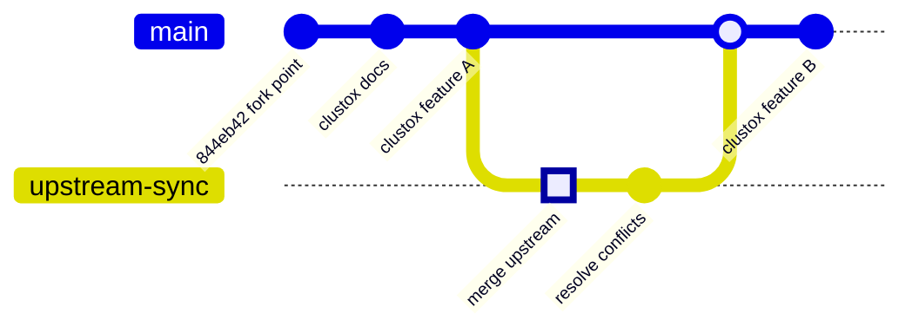
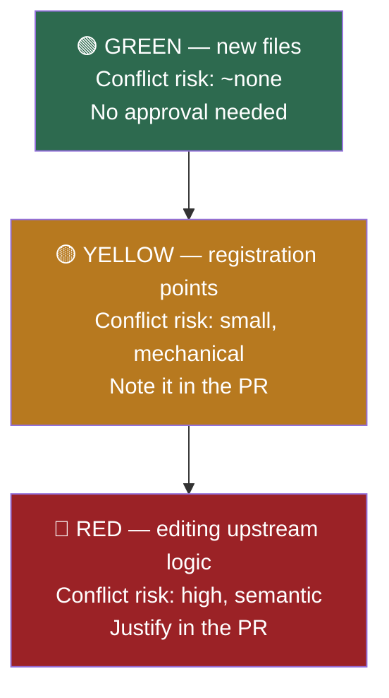

# Fork & Upstream Maintenance Strategy

| | |
|---|---|
| **Fork** | [Clustox/middleware](https://github.com/Clustox/middleware) |
| **Upstream** | [middlewarehq/middleware](https://github.com/middlewarehq/middleware) |
| **Upstream licence** | Apache License 2.0 |
| **Fork point** | `844eb42` on `main` |
| **Divergence today** | **Zero commits.** Clean fork. |
| **Status** | Proposed — needs sign-off before the first customisation lands |

---

## Why this document exists, and why now

Upstream is **actively developed** — the fork point sits on a merge commit from a PR numbered #699,
with fixes landing days apart. Every commit they make from here is one we either take or consciously
decline.

Right now this fork has **zero divergence**. That is the cheapest moment in the entire life of a fork
to decide how it will be maintained. The cost of deciding later compounds: after twenty ad-hoc
customisations scattered through upstream files, "just pull upstream" becomes a multi-day merge with
real risk of silently reverting our own work.

The failure mode is specific and common: six months in, an upstream security fix lands, the merge
conflicts in fifteen files, someone resolves it under time pressure, and a Clustox customisation
quietly disappears. Nobody notices until a customer does.

Verify the current state:

```bash
git log --oneline -1 && git remote -v && git status --short
```

---

## 1. Decide the fork's posture first

Everything downstream follows from one question. **This needs a decision from the CTO before the first
customisation is written**, because it determines how much isolation discipline is worth paying for.

| Posture | What it means | Upstream merge cost | Right when |
|---|---|---|---|
| **A. Track closely** | Stay near-identical to upstream. Customisations are thin and few. Contribute fixes back. | Low, ongoing | We mainly want the product, plus small tweaks |
| **B. Soft fork** | Meaningful Clustox features, but deliberately isolated so upstream files stay mostly untouched. Periodic upstream merges. | Moderate, manageable | **Most likely fit** — we want their engine plus our differentiation |
| **C. Hard fork** | Take the code and go. Upstream becomes a one-time donor. | N/A — we stop merging | Our direction diverges fundamentally |

**Recommendation: B, with the discipline of A.**

Rationale: the upstream codebase is cleanly layered and full of factory/strategy seams (see
[ARCHITECTURE.md §12](./ARCHITECTURE.md#12-extension-points)) that were clearly designed for extension.
Most of what a client would plausibly ask for — a new Git provider, a new deployment source, a new
metric — can be added by *registering* a new implementation rather than editing existing files. That is
exactly the shape that makes posture B cheap. Choosing C forfeits upstream's ongoing work for very
little gain.

The rest of this document assumes B. If the CTO picks A or C, sections 4 and 5 change; the rest holds.

> **Open question for the CTO — worth asking early:** is this fork intended to stay internal, or ship
> to clients? It changes the licence obligations in §7 and the auth work in
> [ARCHITECTURE.md §11.1](./ARCHITECTURE.md#111-no-authentication-on-the-backend-apis) from
> "nice to have" to "blocking".

---

## 2. Remote setup

The fork currently has **only `origin`**. There is no way to fetch upstream at all. First fix:

```bash
git remote add upstream https://github.com/middlewarehq/middleware.git
git remote set-url --push upstream DISABLED
git fetch upstream
```

The `--push DISABLED` line is deliberate: it makes an accidental `git push upstream` fail loudly
instead of attempting to write to a repository we do not own. Cheap insurance.

Verify:

```bash
git remote -v
# origin    https://github.com/Clustox/middleware.git (fetch)
# origin    https://github.com/Clustox/middleware.git (push)
# upstream  https://github.com/middlewarehq/middleware.git (fetch)
# upstream  DISABLED (push)
```

Every engineer on the project runs this once. Add it to the onboarding checklist — a teammate without
the upstream remote cannot review a sync PR properly.

---

## 3. Branch model



`upstream-sync` is cut from `main`, absorbs the upstream merge and all conflict resolution, then goes
back into `main` through a reviewed PR and is deleted. `main` never takes a raw upstream merge directly.

| Branch | Role |
|---|---|
| `main` | **Clustox's product.** Protected. Upstream + our changes. Deployable. |
| `upstream-sync` | Short-lived, one per sync. Where upstream merges and conflict resolution happen. Deleted after merge. |
| `feature/*` | Normal feature work off `main`. |
| `fix/*` | Bug fixes off `main`. |
| `contrib/*` | Work intended for an upstream PR. Kept free of Clustox-specific code. |

**We do not keep a branch that mirrors upstream `main` verbatim** — `upstream/main` already is that
branch, fetched on demand. An extra local mirror is one more thing to forget to update.

### Branch protection to enable on `main`

Configure in GitHub repo settings (needs org admin):

- Require a pull request before merging, minimum 1 approval
- Require status checks: `build`, `pytest`, `black`, `pre-commit`
- Dismiss stale approvals on new commits
- No force-push, no deletion

Rationale: the entire strategy below depends on **sync merges being reviewed**. Without protection,
one `git push --force` to `main` undoes it.

---

## 4. Where Clustox changes are allowed to live

This is the core discipline of the whole document. **Merge pain is almost perfectly proportional to
how many upstream files we edit.** Adding files is nearly free; editing shared files is where conflicts
come from.

### The three-tier rule



**🟢 Green — prefer this. Always ask "can this be a new file?" first.**

- New provider clients: `mhq/exapi/<provider>.py`
- New ETL handlers: `mhq/service/*/sync/etl_<provider>_handler.py`
- New deployment strategies: `mhq/service/deployments/<name>_deployments_service.py`
- New API blueprints: `mhq/api/<name>.py`
- New UI pages/components under new paths
- Anything under `docs/` or `clustox/`

**🟡 Yellow — unavoidable, keep surgical.** Upstream's extension seams are *designed* to be edited, but
they are also the lines upstream touches when they add their own providers. Conflicts here are
one-line and mechanical.

- Factories: `etl_code_factory.py`, `etl_workflows_factory.py`, `deployments/factory.py`
- Enums: `CodeProvider`, `RepoWorkflowProviders`, `DeploymentType`
- Blueprint registration in `app.py` / `sync_app.py`
- `sync_sequence` in `sync_data.py`

Keep the diff to the minimum lines. Add at the **end** of enums and lists, never in the middle — a
trailing addition conflicts far less often than an insertion.

**🔴 Red — requires explicit justification in the PR description.** Editing existing upstream logic.
State what you changed, why a green/yellow approach did not work, and what breaks if an upstream merge
silently reverts it.

- Metric computation: `lead_time.py`, `analytics.py`, `incidents.py`
- The MTD broker: `mtd_handler.py`
- Existing models in `mhq/store/models/**`
- `web-server/src/utils/db.ts`, `constants/db.ts`
- Anything in `setup_utils/`, `Dockerfile*`, `docker-compose.yml`

### Marking red-zone edits so a merge cannot silently eat them

Every edit to an upstream file gets a sentinel comment:

```python
# CLUSTOX: <what and why> — <ticket>
... our change ...
# END CLUSTOX
```

```typescript
// CLUSTOX: <what and why> — <ticket>
```

```sql
-- CLUSTOX: <what and why> — <ticket>
```

This is not decoration. It gives us a **one-command audit** of our entire divergence footprint, which
becomes the review checklist during every upstream sync:

```bash
grep -rn "CLUSTOX:" --include='*.py' --include='*.ts' --include='*.tsx' --include='*.sql' . \
  | grep -v node_modules
```

After a sync merge, this count should not drop. If it does, the merge ate one of our changes.

### The database exception

Custom columns and tables need their own migration files (green — new files), but they mutate a schema
upstream also migrates. Two rules:

- **Prefix custom migrations** `<timestamp>_clustox_<name>.sql` so they are identifiable at a glance.
- **Never edit an upstream migration that has already run.** `dbmate` tracks applied migrations; editing
  one that has run is a silent no-op locally and a divergence in every other environment.
- Remember custom columns are a **four-place change** — see
  [ARCHITECTURE.md §12.5](./ARCHITECTURE.md#125-add-a-database-column).

---

## 5. The upstream sync procedure

**Cadence: monthly, plus immediately for any upstream security fix.** Monthly is frequent enough that
each merge is small, infrequent enough that it is not a tax. Put it on someone's calendar — syncs that
depend on someone remembering do not happen.

### Step 1 — See what is coming before committing to it

```bash
git fetch upstream
git log --oneline main..upstream/main | wc -l          # how many commits behind
git log --oneline main..upstream/main                  # what they are
git diff --stat main..upstream/main                    # blast radius
```

Then check the overlap between what upstream changed and what we have touched:

```bash
# Files upstream changed
git diff --name-only main..upstream/main | sort > /tmp/upstream-changed.txt
# Files we changed since the fork point
git diff --name-only 844eb42..main | sort > /tmp/clustox-changed.txt
# The intersection is exactly where conflicts will be
comm -12 /tmp/upstream-changed.txt /tmp/clustox-changed.txt
```

That last command is the whole risk assessment in one line. Empty output means a trivial merge.

### Step 2 — Merge on a branch, never on `main`

```bash
git checkout main && git pull origin main
git checkout -b upstream-sync/$(date +%Y-%m)
git merge upstream/main
```

**Merge, not rebase.** `main` is shared and protected; rebasing rewrites published history. A merge
commit also leaves an honest record of exactly when each upstream batch arrived.

### Step 3 — Resolve, with the sentinel audit as the checklist

For each conflict, the question is always: *does upstream's change subsume ours, or must both survive?*

```bash
git status --short | grep '^UU'          # conflicted files
git checkout --theirs <path>             # take upstream wholesale
git checkout --ours <path>               # keep ours wholesale
# — but usually: edit by hand and keep both
```

Then confirm nothing of ours vanished:

```bash
grep -rn "CLUSTOX:" --include='*.py' --include='*.ts' --include='*.tsx' --include='*.sql' . \
  | grep -v node_modules | wc -l
```

Compare against the pre-merge count. A drop means a resolution dropped one of our changes — go find it.

### Step 4 — Verify

```bash
# Backend
cd backend/analytics_server && python -m pytest tests/ -q && cd ../..
black --check backend/
flake8 backend/

# Frontend
cd web-server && yarn jest && cd ..

# Migrations still apply, app still boots
docker compose down -v && docker compose up --build
```

Then a manual smoke pass, because the automated suite is thin (20 Python test files, and the BFF/knex
path is largely uncovered — see
[ARCHITECTURE.md §10.5](./ARCHITECTURE.md#105-ci-and-tests)):

- [ ] All six supervisord processes running (`docker compose logs`)
- [ ] UI loads at :3333
- [ ] Integration settings page renders and the existing PAT still decrypts
- [ ] `curl -X POST http://localhost:9697/sync` completes; check `/system-logs` for per-repo errors
- [ ] All four DORA metrics render with data
- [ ] Every Clustox customisation still behaves

**The PAT-decrypt check matters more than it looks.** Token encryption depends on the RSA keypair in
the `dev_keys` volume; a `docker compose down -v` destroys it. If upstream changes anything about
`utils/cryptography.py` or the config bootstrap, this is where it surfaces.

### Step 5 — PR into `main`

Open `upstream-sync/YYYY-MM` → `main`, with a description covering:

- Commit count and date range pulled
- Notable upstream changes affecting us
- Every conflict and how it was resolved
- Sentinel count before/after
- Smoke-test results

Reviewed by someone who did not do the merge. This is the control that catches a silently reverted
customisation, and it is the reason `main` is protected.

### Step 6 — Record it

Append to `docs/UPSTREAM_SYNC_LOG.md`:

| Date | Upstream ref | Commits | Conflicts | Notes |
|---|---|---|---|---|
| _(first sync)_ | | | | |

---

## 6. Contributing back to upstream

Worth doing deliberately, for two self-interested reasons: **anything upstream accepts is code we no
longer maintain**, and a visible Clustox presence in an active OSS project is good for the company.

**Send upstream:** genuine bug fixes, provider integrations of general use, performance work, doc fixes.
**Keep private:** Clustox branding, client-specific logic, anything commercially differentiating.

Work on a `contrib/*` branch cut from `upstream/main` (not from `main`), so the PR contains no Clustox
code and no sentinel comments:

```bash
git fetch upstream
git checkout -b contrib/<short-name> upstream/main
# ... make the change, no CLUSTOX: markers ...
git push origin contrib/<short-name>
# open PR: Clustox/middleware contrib/<name> → middlewarehq/middleware main
```

Read [`CONTRIBUTING.md`](../CONTRIBUTING.md) and [`CODE_OF_CONDUCT.md`](../CODE_OF_CONDUCT.md) first;
upstream has an active community and its own review conventions.

> **Check before the first external contribution:** whether Clustox requires anything of employees
> contributing to third-party OSS, and whether upstream asks for a CLA. Better to ask than to retract.

---

## 7. Licence obligations (Apache 2.0)

Not legal advice — flag anything commercially significant to whoever owns legal at Clustox. But the
mechanics are simple and we are currently not meeting one of them.

**What Apache 2.0 permits:** commercial use, modification, private use, distribution, sublicensing.
We can build a product on this and sell it. We are **not** required to open-source our changes.

**What it requires when we distribute:**

| Requirement | Status |
|---|---|
| Include the Apache 2.0 licence text | ✅ [`LICENSE`](../LICENSE) is present |
| Preserve copyright/attribution notices | ⚠️ **Gap** — see below |
| State significant changes made to the files | ⚠️ Not yet — the `CLUSTOX:` sentinels are the mechanism |
| Include the `NOTICE` file if one exists | ⚠️ **Gap — no `NOTICE` file exists** |

### The gap, and the fix

Apache 2.0 §4(d) requires preserving attribution notices in derivative works. This fork has **no
`NOTICE` file** — verify with `ls NOTICE`. Upstream did not ship one, so strictly we are not yet
failing to propagate theirs; but once we distribute a modified version, clean attribution is both an
obligation and simply good practice.

A [`NOTICE`](../NOTICE) file has been added in this change set recording upstream authorship and
Clustox's modifications. Keep it current as the fork diverges.

**Also do not:** use the Middleware name or logo to brand a Clustox product (trademarks are not granted
by Apache 2.0 — §6), or imply upstream endorsement. If we ship this to clients under a Clustox name,
`media_files/` and README branding need review.

---

## 8. Immediate actions

Ordered. Items 1–4 are the ones to do before any customisation lands.

| # | Action | Owner | Status |
|---|---|---|---|
| 1 | **CTO decides the fork posture** (§1) — blocks the rest | CTO | ⬜ |
| 2 | Add the `upstream` remote, push-disabled (§2) | Every engineer | ⬜ |
| 3 | Enable branch protection on `main` (§3) | Repo admin | ⬜ |
| 4 | Agree the three-tier rule and `CLUSTOX:` sentinel (§4) | Team | ⬜ |
| 5 | Add `NOTICE`, keep it current (§7) | — | ✅ added |
| 6 | Confirm CI is green on the fork, record the baseline | — | ⬜ |
| 7 | Create `docs/UPSTREAM_SYNC_LOG.md`, do a first sync to prove the runbook | — | ⬜ |
| 8 | Put the monthly sync on a calendar with a named owner | Team lead | ⬜ |

Two notes on sequencing. **Item 6 before any code changes** — if upstream CI is already failing on our
fork, that is far better discovered now than blamed on our first feature. And **item 7's first sync
should happen while divergence is still zero**, precisely because it is guaranteed trivial: it proves
the runbook works before we need it under pressure.

---

## Appendix — Command reference

```bash
# One-time setup
git remote add upstream https://github.com/middlewarehq/middleware.git
git remote set-url --push upstream DISABLED

# How far behind are we?
git fetch upstream && git log --oneline main..upstream/main | wc -l

# Where will conflicts happen?
comm -12 \
  <(git diff --name-only main..upstream/main | sort) \
  <(git diff --name-only 844eb42..main | sort)

# Our full divergence footprint
grep -rn "CLUSTOX:" --include='*.py' --include='*.ts' --include='*.tsx' --include='*.sql' . \
  | grep -v node_modules

# Start a sync
git checkout main && git pull origin main
git checkout -b upstream-sync/$(date +%Y-%m)
git merge upstream/main

# Start an upstream contribution (clean of Clustox code)
git checkout -b contrib/<name> upstream/main
```
