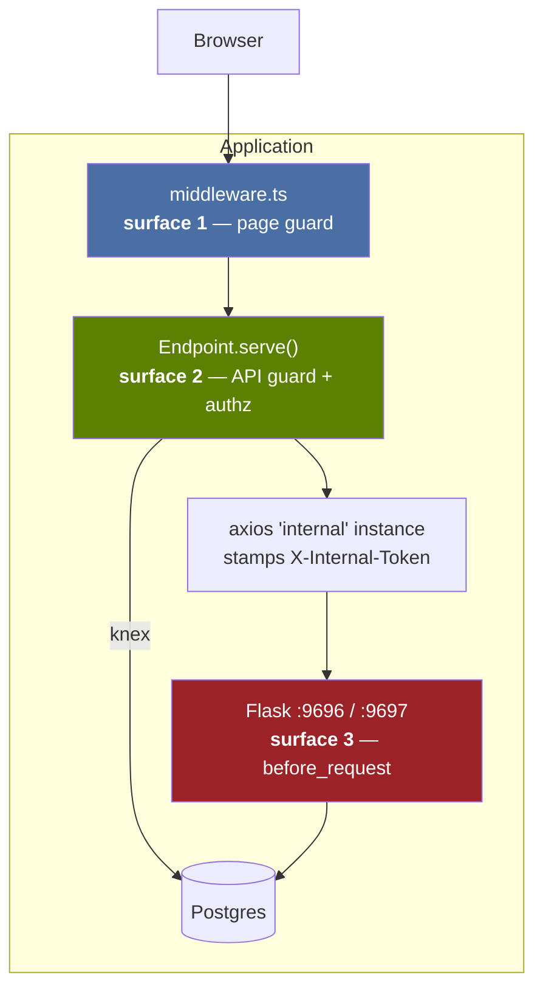

# Design: Authentication & Role-Based Access Control

| | |
|---|---|
| **Date** | 2026-08-05 |
| **Status** | Approved — ready for implementation planning |
| **Repo** | [Clustox/middleware](https://github.com/Clustox/middleware) (fork of middlewarehq/middleware) |
| **Baseline** | `844eb42` |
| **Related** | [ARCHITECTURE.md](../../ARCHITECTURE.md) · [FORK_STRATEGY.md](../../FORK_STRATEGY.md) |

---

## 1. Context

The application currently has **no authentication of any kind**. Anyone who can reach the app
gets full access to every dashboard, every setting, and every integration.

This is not an oversight in our deployment — it is how upstream ships. Verified:

```bash
# Backend API — zero matches
grep -rniE "login_required|authenticat|jwt|api_key|bearer" backend/analytics_server/mhq/api/
# Frontend — no NextAuth route, no sign-in page
find web-server/pages -path '*nextauth*'
ls web-server/pages | grep -iE 'login|signin'
```

Upstream evidently *had* auth and stripped it for the open-source build. What remains is
scaffolding with the enforcement removed:

| Artefact | State |
|---|---|
| `web-server/src/components/Authenticated/index.tsx` | Wraps every page. Sets `verified = true` unconditionally and shows a toast reading "You are successfully authenticated!". Checks nothing. |
| `Endpoint.authenticated` (`src/api-helpers/global.ts`) | Field declared, constructor accepts `{ unauthenticated: true }`, **`serve()` never reads it**. |
| `UserRole` enum (`src/types/resources.ts`) | `EM`, `ENGINEER`, `MOM`. Never enforced. |
| `AuthContext.role` | Hardcoded to `UserRole.MOM` (the most privileged). |
| `AuthContext.userId` | Hardcoded to `00000000-0000-0000-0000-000000000000`. |
| `Users.role_override` column | Exists in schema, referenced nowhere in code. |
| `next-auth` in `package.json` | No `[...nextauth]` route, no sign-in page. Only imports are a `Session` *type* and a `signIn` call in an error component that has nothing to call. |

**This is good news.** The hook points we need were designed in; only the wiring was removed.
Five routes already correctly declare `{ unauthenticated: true }`, which tells us the opt-out
mechanism was intended to be enforced.

### Goal

Only people with credentials reach the dashboards. Superadmins manage users and integrations and
see everything; admins see only the teams assigned to them.

### Considered and rejected: an identity-aware proxy

Putting `oauth2-proxy` / Cloudflare Access in front of the app would solve the perimeter problem
with **zero fork changes** and provide Google sign-in for free. It was recommended and rejected in
favour of in-app auth, deliberately, for two reasons:

1. A proxy is all-or-nothing. It cannot express "this admin sees only Team ZDA", which is a stated
   requirement.
2. The team wants a demonstrable product capability, not a deployment configuration change.

This is recorded so the trade-off is not relitigated later, and so the per-team scoping
requirement — the thing that actually justifies building in-app — is not quietly dropped from
scope. **If per-team scoping is ever cut, revisit the proxy option instead.**

---

## 2. Scope

### In scope (v1)

- Email + password login, bcrypt-hashed
- Superadmin bootstrapped from environment variables on first boot
- Two roles: `SUPERADMIN`, `ADMIN`
- Per-team access scoping for `ADMIN`
- User management page (superadmin only): create user, set role, assign teams
- Lock the Flask servers so they are reachable only from the BFF
- Structured so a Google provider drops in without rework

### Explicitly out of scope (v1)

| Deferred | Why |
|---|---|
| Google sign-in | Needs a Google Cloud OAuth app; would block the demo. Design keeps the seam open. |
| Password reset / email flows | Needs SMTP. v1: superadmin re-creates the user. |
| Audit log of who viewed what | Valuable, but separate work. |
| Bitbucket integration | Unrelated to auth. There is a `BITBUCKET` constant but **no ETL handler exists** — it is net-new integration work. |
| Multi-org / true tenancy | The app is hardwired to a single `default` org. Out of scope. |

---

## 3. Decisions and rationale

| # | Decision | Rationale |
|---|---|---|
| D1 | New tables, not new columns on `Users` | Upstream's schema stays untouched, so their migrations can never collide with ours. Joins are trivial. |
| D2 | Do not reuse `role_override` or `UserRole` | `role_override` is dead and undocumented; `UserRole` (`EM`/`ENGINEER`/`MOM`) is a reporting-hierarchy concept, not a permission one. Overloading either would confuse both. |
| D3 | Enforce BFF auth inside `Endpoint.serve()` | Every real API route goes through it (verified below). One insertion point instead of 47. |
| D4 | Lock Flask to BFF-only via shared secret | Lets **all** authorization live in the BFF. No user context threaded through Python, no changes to any service/repo file. |
| D5 | JWT sessions; team access read per-request from DB | Role in the token is fine; team assignments must not be, or changing someone's teams wouldn't take effect until they re-login. |
| D6 | `share.ts` becomes authenticated | See §8. |

### Verification behind D3

All 53 files under `pages/api/` were classified:

- **47** construct `new Endpoint(...)` — every real route
- **2** are test files (`__tests__/`)
- **4** are helper modules with **no `export default`** — not routes at all:
  `internal/[org_id]/utils.ts`, `internal/team/[team_id]/{deployment_freq,deployment_prs,revert_prs}.ts`

```bash
# reproduce
for f in $(find web-server/pages/api -name '*.ts'); do
  grep -q "export default" "$f" || echo "not a route: $f"
done
```

So `Endpoint.serve()` gives **100% coverage of BFF routes with no stragglers.**

---

## 4. Data model

One new migration, `database-docker/db/migrations/<timestamp>_clustox_auth.sql`:

```sql
CREATE TABLE "ClustoxUserAuth" (
  user_id       uuid PRIMARY KEY REFERENCES "Users"(id) ON DELETE CASCADE,
  password_hash text NOT NULL,
  role          varchar NOT NULL CHECK (role IN ('SUPERADMIN','ADMIN')),
  created_at    timestamptz NOT NULL DEFAULT now(),
  updated_at    timestamptz NOT NULL DEFAULT now()
);

CREATE TABLE "ClustoxUserTeamAccess" (
  user_id    uuid NOT NULL REFERENCES "Users"(id) ON DELETE CASCADE,
  team_id    uuid NOT NULL REFERENCES "Team"(id) ON DELETE CASCADE,
  created_at timestamptz NOT NULL DEFAULT now(),
  PRIMARY KEY (user_id, team_id)
);

CREATE INDEX idx_clustox_user_team_access_user ON "ClustoxUserTeamAccess"(user_id);
```

Identity itself continues to live in upstream's `Users` table (`id`, `name`, `primary_email`,
`is_deleted`). `ClustoxUserAuth` adds only credentials and role.

`SUPERADMIN` needs no rows in `ClustoxUserTeamAccess` — the role short-circuits every scope check.

Per [ARCHITECTURE.md §12.5](../../ARCHITECTURE.md), a schema change is normally a four-place
change. Here it is **three**: migration, `schema.sql`, and `web-server/src/constants/db.ts`. No
SQLAlchemy model is needed, because Python never reads these tables.

---

## 5. Architecture

### 5.1 Three surfaces

Auth that covers only the frontend is decorative — the Flask API is independently reachable, and 23
BFF files bypass Flask to reach Postgres directly via knex. All three paths must be closed.



| Surface | Mechanism | Failure mode if omitted |
|---|---|---|
| 1 — Pages | `middleware.ts` redirects unauthenticated requests to `/login` | Cosmetic only; data still protected by 2 and 3 |
| 2 — BFF routes | `Endpoint.serve()` rejects when `this.authenticated` and no valid session | **Total bypass** — every metric and mutation exposed |
| 3 — Flask | One `before_request` rejects requests without the shared secret | **Total bypass** — `curl :9696` returns everything |

### 5.2 Session

`next-auth` v4 (already a dependency) with a **Credentials** provider and **JWT** strategy.

- Token carries `userId` and `role`.
- Team assignments are **not** in the token; they are read per-request from
  `ClustoxUserTeamAccess`. Cheap (indexed, single-row-set) and avoids stale permissions.
- `NEXTAUTH_SECRET` and `NEXTAUTH_URL` added to `.env` / `env.example`.

Adding Google later means registering a second provider and mapping the Google email onto an
existing `Users` row. No change to the authorization layer.

### 5.3 Authorization

Because Flask is BFF-only after surface 3, **all authorization lives in the BFF**:

```ts
// CLUSTOX: new file — src/auth/guard.ts
assertRole(session, 'SUPERADMIN')          // throws 403
assertTeamAccess(session, team_id)         // SUPERADMIN passes; ADMIN checked against table
visibleTeamIds(session)                    // for list endpoints
```

Applied at:

- **Team-scoped routes** — `assertTeamAccess` against the `team_id` in the path or payload
- **Team list endpoints** — filtered through `visibleTeamIds`, so an admin's team dropdown shows
  only their teams
- **Integration + settings routes** — `assertRole(SUPERADMIN)`
- **User management routes** — `assertRole(SUPERADMIN)`

An admin who guesses another team's UUID gets a 403 rather than data. That property is what makes
this more than a login screen, and it is the subject of an explicit test.

### 5.4 Superadmin bootstrap

On first boot, if no `SUPERADMIN` exists, create one from `SUPERADMIN_EMAIL` and
`SUPERADMIN_PASSWORD`. Idempotent, and never overwrites an existing account. If the env vars are
absent and no superadmin exists, log a loud warning — a running instance with no superadmin cannot
be administered.

---

## 6. File inventory

### Upstream files modified (red/yellow zone — six files)

| File | Change | Size |
|---|---|---|
| `web-server/middleware.ts` | Redirect unauthenticated to `/login`; allow `/api/auth/*` | ~15 lines |
| `web-server/src/api-helpers/global.ts` | Enforce the existing `authenticated` flag in `serve()` | ~8 lines |
| `web-server/src/api-helpers/axios.ts` | Stamp `X-Internal-Token` on the `internal` instances | ~4 lines |
| `backend/analytics_server/app.py` | Register `before_request` hook | 2 lines |
| `backend/analytics_server/sync_app.py` | Register `before_request` hook | 2 lines |
| `web-server/src/constants/db.ts` | Declare the two new tables for knex | ~20 lines |

Every one gets a `CLUSTOX:` sentinel per [FORK_STRATEGY.md §4](../../FORK_STRATEGY.md).

Of the six, `constants/db.ts` is the lowest-risk: it is a declaration table that grows by append, so
conflicts there are mechanical. The two Python entry points are one line each. The real thought goes
into `global.ts` and `middleware.ts`.

### New files (green zone)

```
database-docker/db/migrations/<ts>_clustox_auth.sql
backend/analytics_server/mhq/clustox_auth/internal_token.py
web-server/pages/login.tsx
web-server/pages/users.tsx
web-server/pages/api/auth/[...nextauth].ts
web-server/pages/api/clustox/users/index.ts          # list, create
web-server/pages/api/clustox/users/[user_id].ts      # update role, teams; delete
web-server/src/auth/guard.ts
web-server/src/auth/password.ts
web-server/src/auth/bootstrap.ts
web-server/src/auth/queries.ts
```

`Authenticated/index.tsx` is left alone — `middleware.ts` does the real work, and rewriting the
stub only adds divergence.

### Fork impact

Cross-cutting auth for five touched upstream files is an unusually good ratio, entirely because
upstream left the hook points in. This remains **permanent divergence**: upstream will not accept
it, since gated auth is plausibly what their commercial product sells.

---

## 7. Demo script

1. Open the app → redirected to `/login` *(today it walks straight in)*
2. Log in as superadmin → all teams visible, **Users** appears in nav
3. Create an admin, assign to `ZDA` only
4. Log out, log in as that admin → only `ZDA`; no Users page; integrations hidden
5. As that admin, request `CGPT Frontend`'s team ID directly → **403**
6. `curl http://localhost:9696/teams/<id>/lead_time` → **403** *(today: returns data)*

Steps 5 and 6 are the ones worth dwelling on. Step 6 in particular is what separates real access
control from a login screen, and it is the part most implementations get wrong.

---

## 8. Risks and mitigations

| Risk | Mitigation |
|---|---|
| **`share.ts` is currently `unauthenticated`** — a URL-shortener storing dashboard link state in `URLShortenerData`. Anonymous `POST` allows unbounded row insertion; anonymous `GET` returns stored link metadata. | **Decision:** make it authenticated. For an internal tool, everyone who should open a share link has an account, so nothing is lost and an anonymous write path is closed. |
| Password handling becomes our responsibility | bcrypt (cost 12), never log or return hashes, no reset flow in v1 — a stated limitation, not a hidden gap |
| Someone adds a route bypassing `Endpoint` | Test asserting every file under `pages/api` with a default export constructs an `Endpoint` |
| Shared secret leaks or is unset | Fail closed: if `INTERNAL_API_TOKEN` is unset, Flask rejects **all** requests rather than allowing all |
| Locking Flask breaks the cron sync | Cron calls `:9697/sync` from inside the container. It must send the token too — **verify explicitly**, since the failure is silent (see [ARCHITECTURE.md §7.4](../../ARCHITECTURE.md)) |
| Bootstrap creates a weak default account | No default password. Absent env vars → no superadmin + loud warning, never a known-value fallback |
| Permanent fork divergence | Accepted deliberately; sentinels make the footprint auditable |

---

## 9. Testing

| Layer | Coverage |
|---|---|
| Jest | `assertRole`, `assertTeamAccess`, `visibleTeamIds`; password hash/verify; `Endpoint.serve()` rejects without session and honours `unauthenticated` |
| pytest | Flask `before_request`: valid token passes, missing/wrong 403s, unset env fails closed |
| Playwright | The §7 demo flow end to end |
| Regression | Unauthenticated `curl` to a team route returns 403 — the single test that would catch the whole feature being silently undone |
| Manual | Cron sync still succeeds after Flask is locked down |

---

## 10. Open questions

None blocking. Two to settle during implementation, neither affecting the architecture:

1. Session lifetime — proposed 12 hours, no sliding renewal.
2. Whether the admin's team dropdown should hide inaccessible teams entirely or show them disabled.
   Proposed: hide, matching `visibleTeamIds`.
